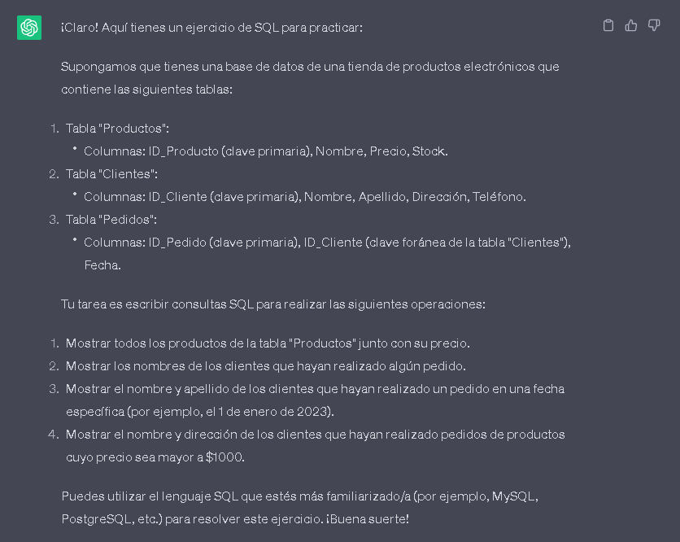
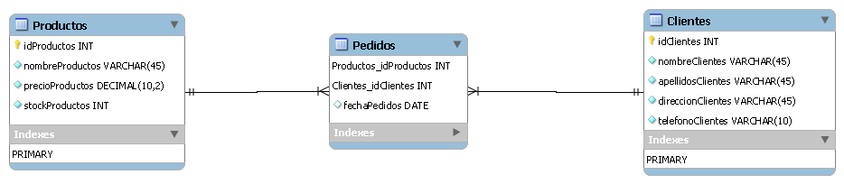

#  DESAFIO SQL DADO POR CHATGPT 

### 😋 Empezare por dar algo de Contexto:

#### En este 🚀emocionante proyecto, decidí ver las habilidades de 🤖ChatGPT más allá de su uso habitual. Si bien es conocido por su capacidad para escribir código y encontrar errores, me pregunté: ¿podrá 🤖ChatGPT ayudarme también con ejercicios de SQL?

#### Es por eso que Pedi a 🤖ChatGPT un ejercicio de SQL. Para mi sorpresa, ¡🤖ChatGPT respondió de manera asombrosa! No solo me ofreció un ejercicio interesante, sino que también me inspiró para compartir esta experiencia en un próximo video de mi canal de YouTube.

#### El ejercicio propuesto por 🤖ChatGPT no es extremadamente complejo, pero ciertamente requerirá un poco de práctica y pensamiento lógico para resolverlo. Sin más preámbulos, les comparto el ejercicio que me que me ofrecio: 
 

#### 🚀Me emociona compartir el progreso de este ejercicio. Como primer paso, me he dedicado a modelar la base de datos que utilizaré en el ejercicio propuesto. he establecido el modelo entidad-relación que considero más adecuado para nuestros propósitos.

#### En los próximos días, estaré trabajando en la implementación de las consultas que pondrán a prueba si el modelo propuesto fue correcto para este ejercicio.

#### Cabe mencionar que este Script fue creado específicamente para Mysql, asegurándonos de aprovechar al máximo las funcionalidades de esta potente base de datos.

#### Estoy ansioso por compartir los avances y resultados de este emocionante desafío. ¡Mantente atento a las próximas actualizaciones!

 

###  Sigueme en mis redes Sociales y enterate del contenido que hago: .

 

